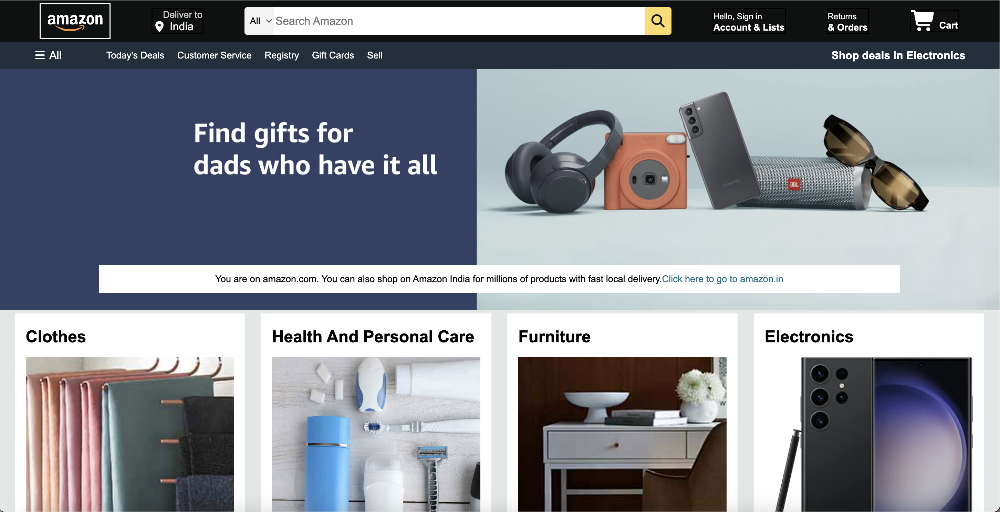

# 🛒 Amazon Homepage Clone  

A simple and responsive **Amazon Homepage Clone** built using **HTML & CSS**.  
This project is a practice clone to strengthen my frontend skills and understand how real-world websites structure their layouts.  

---

## 📸 Preview  
 

---

## ⚡ Features  
- ✅ Fully responsive design  
- ✅ Header with logo, search bar & navigation links  
- ✅ Styled product sections & banners  
- ✅ Footer with multiple columns like Amazon  
- ✅ Clean and beginner-friendly code  

---

## 🛠️ Technologies Used  
- **HTML5** for structure  
- **CSS3** for styling (flexbox, responsive design)  

---
📚 What I Learned
- Creating layouts with Flexbox
- Positioning elements like a real e-commerce site
- Importance of reusable CSS components

## 🚀 Getting Started  

To view the project locally:  

```bash
# Clone this repository
git clone https://github.com/your-username/amazon-clone.git

# Open index.html in your browser
